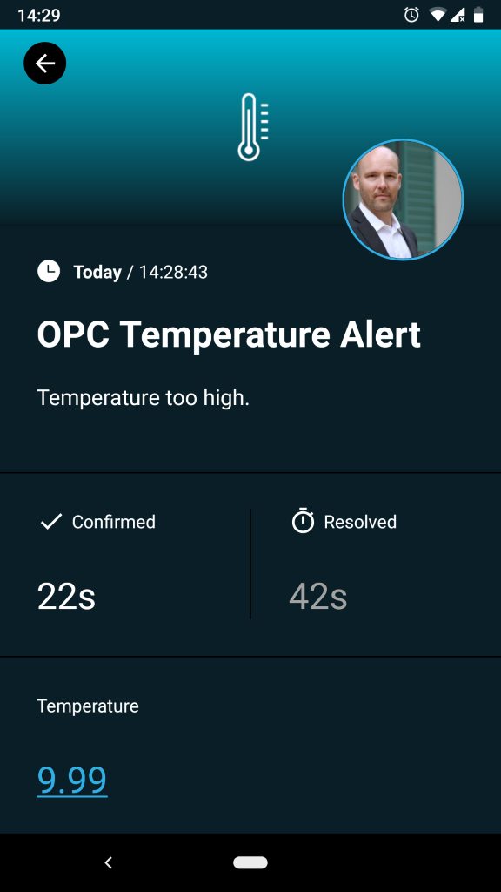
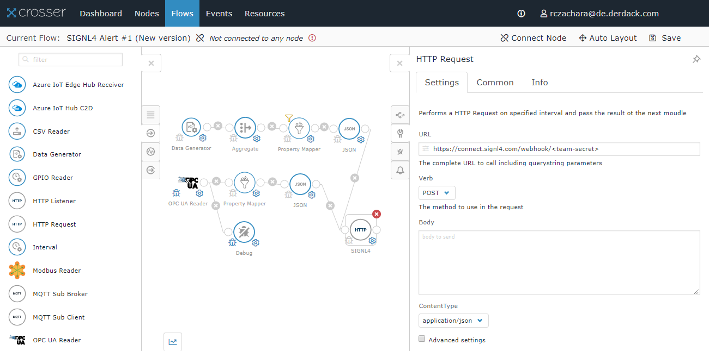
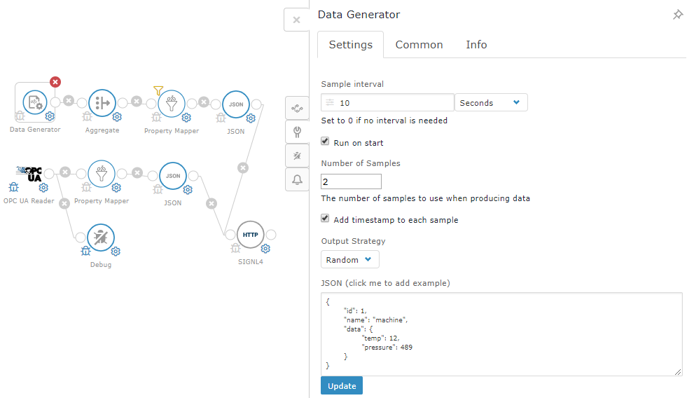
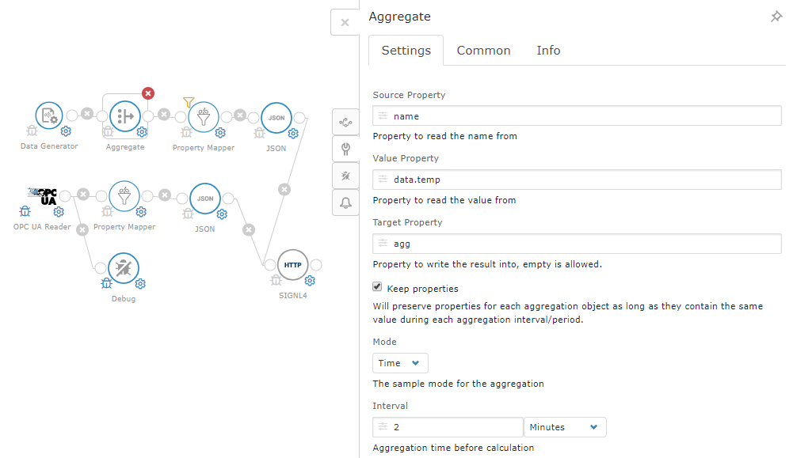
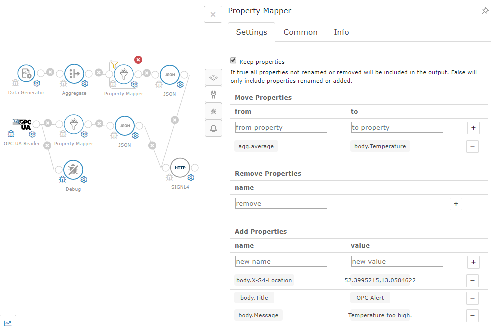

# Integrating SIGNL4 with Crosser

Mobile alerting with tracking, duty planning and escalation for Crosser.

## Why SIGNL4

Crosser an Industrial IoT platform for easy integration and automation of connected devices.

## How it Works

All it takes to pair Crosser and SIGNL4 is an HTTP Request action in Crosser Cloud that calls the SIGNL4 webhook to trigger the alert.

## Integration Capabilities

- Service engineers alerted via mobile push, text and voice
- Staff can acknowledge and take ownership for critical events that occur
- Alerts are escalated in case of no response
- Communicate within an alert to address a particular problem
- Alert on critical device states
- Two-way integration to interact or set the device state

## Scenarios

- Industrial IoT
- Industry 4.0
- IoT Service Alerting
- IoT Device Management
- Manufacturing, Utility, Oil and Gas, Agriculture, etc.

## How To Integrate

### Integrating SIGNL4 with Crosser

In our example we create a sample flow that receives OPC UA data, processes them and then generates an alert in SIGNL4.

SIGNL4 is a mobile alert notification app for powerful alerting, alert management and mobile assignment of work items. Get the app at https://www.signl4.com.

In order to show the concept in a simplified way we also use a data generator that is capable to generate sample data. This makes it easy to simulate alerts.

### Prerequisites

A SIGNL4 (https://www.signl4.com) account

A Crosser (https://crosser.io) account

#### Integration Steps

1. Create the Data Generator  
Logon to the Crosser portal and go to Flows. Here you can add a Data Generator action. This one simulates random event data in certain intervals.

2. Date Aggregation (Optional)  
The next step in the flow is the aggregation. This is optional but since it is a powerful feature we show it here. The idea is to read events over a certain period of time and then aggregate the data. In our case we are interested in the average temperature.

3. Property Mapper  
The idea of the Property Mapper is to assemble the message data we would like to send to SIGNL4. This is all JSON.

The property:

body.Message: "Temperature too high."

will become this in JSON:

{"Message": "Temperature too high."}

Besides the property mapping we can also add conditions here. We can do so in the Common section of the Property Mapper.

We add the following Message Filter:

agg.average > 10

Which means that the average temperature must be greater than 10 in order to proceed with the flow.

4. Make it JSON  
The next step is to JSONify the properties and values. In order to do so you can just add the JSON action and keep all the default properties there.

5. Send SIGNL4 Alert  
Last but not least we add our SIGNL4 action. This is an HTTP Request. The URL is your SIGNL4 webhook with your team secret:
https://connect.signl4.com/webhook/<team-secret>

The method (Verb) is Post (HTTP Post) and Body remains empty. This is because we have assembled the JSON body in the steps above.

6. Test It  
This is it. You can now connect your flow to a node (Connect Node -> Select or create a Sandbox node), save your flow and not sample data is being generated and you should receive SIGNL4 alerts on your phone.

You can find a sample script in GitHub:
https://github.com/signl4/signl4-integration-crosser
